<p align="center">
  <h1 align="center">⚡ TripWire</h1>
  <p align="center"><strong>x402 Execution Middleware</strong></p>
  <p align="center">The infrastructure layer between onchain micropayments and application execution.<br/>Stripe Webhooks for the x402 protocol.</p>
</p>

<p align="center">
  
  
  
  
  
</p>

---

## 🧠 What is TripWire?

When a user pays for an API call via the [x402 protocol](https://www.x402.org/), an ERC-3009 `transferWithAuthorization` settles onchain -- but nothing tells the application to *execute*. TripWire fills that gap. It watches the chain for payment events, verifies finality, resolves payer identity via ERC-8004, evaluates developer-defined policies, and delivers a signed webhook to the application so it can fulfill the request.

Think of it as **Stripe Webhooks for crypto-native micropayments**: you register an endpoint, TripWire watches for payments to your address, and you get a verified `payment.confirmed` webhook with everything you need to execute.

---

## ✨ Key Features

- **Two Delivery Modes** -- *Notify* (Supabase Realtime push for lightweight listeners) and *Execute* (Svix webhook delivery with retries, HMAC signing, and dead-letter queue)
- **Svix-Powered Webhooks** -- One API call gives you exponential-backoff retries, HMAC signature verification, delivery logs, and a DLQ -- zero infrastructure to manage
- **ERC-8004 Agent Identity** -- Resolve onchain AI agent identities (agent class, deployer, capabilities, reputation score) and enrich every webhook payload
- **Goldsky Indexing** -- Goldsky Mirror/Turbo streams ERC-3009 events directly into Supabase in real time -- no subgraph, no polling
- **Policy Engine** -- Filter payments by min/max amount, sender allowlists/blocklists, required agent class, minimum reputation score, and custom finality depth
- **Python SDK** -- Async client with full type safety, endpoint registration, subscription management, and webhook signature verification
- **Multi-Chain** -- Base, Ethereum, and Arbitrum out of the box, with per-chain finality tracking

---

## 🏗️ Architecture

```mermaid
flowchart LR
    subgraph L0["L0 -- Chain"]
        A[Base / Ethereum / Arbitrum]
    end

    subgraph L1["L1 -- Indexing"]
        B[Goldsky Mirror/Turbo]
    end

    subgraph L2["L2 -- Middleware"]
        C[TripWire FastAPI]
        C1[Verification & Dedup]
        C2[ERC-8004 Identity]
        C3[Policy Engine]
        C --> C1 --> C2 --> C3
    end

    subgraph L3["L3 -- Delivery"]
        D[Svix]
        D1[Retries + HMAC + DLQ]
        D --> D1
    end

    subgraph L4["L4 -- Application"]
        E[Developer API]
    end

    A -- "ERC-3009 events" --> B
    B -- "Stream into Supabase" --> C
    C3 -- "Dispatch webhook" --> D
    D1 -- "Signed POST" --> E
```



**The flow**: An ERC-3009 `transferWithAuthorization` settles onchain (L0). Goldsky indexes it in real time and pipes the event into Supabase (L1). TripWire picks it up, verifies the transfer, deduplicates by nonce, resolves the payer's ERC-8004 identity, and evaluates policies (L2). If the payment passes, TripWire dispatches a signed webhook via Svix (L3), which handles retries and HMAC signing. The developer's application receives a `payment.confirmed` POST and executes business logic (L4).

---

## 🚀 Quick Start

### Prerequisites

- Python 3.11+
- A [Supabase](https://supabase.com) project (free tier works)
- A [Svix](https://svix.com) account (free tier: 50k messages/month)
- (Optional) A [Goldsky](https://goldsky.com) account for live chain indexing

### 1. Clone the repository

```bash
git clone https://github.com/anthropics/TripWire.git
cd TripWire
```

### 2. Install dependencies

```bash
pip install -e ".[dev]"
```

### 3. Configure environment

```bash
cp .env.example .env
# Edit .env with your Supabase, Svix, and RPC credentials
```

### 4. Run database migrations

Execute the SQL migration against your Supabase project:

```bash
# Via Supabase Dashboard: SQL Editor -> paste contents of:
# tripwire/db/migrations/001_initial.sql
```

### 5. Start the server

```bash
python -m tripwire.main
```

The API starts on `http://localhost:3402` by default. Verify with:

```bash
curl http://localhost:3402/health
# {"status":"ok"}
```

---

## 📡 API Endpoints

All endpoints are mounted under `/api/v1`.

| Method | Path | Description |
|--------|------|-------------|
| `GET` | `/health` | Health check |
| `POST` | `/api/v1/endpoints` | Register a new webhook endpoint |
| `GET` | `/api/v1/endpoints` | List all active endpoints |
| `GET` | `/api/v1/endpoints/{id}` | Get endpoint details |
| `PATCH` | `/api/v1/endpoints/{id}` | Update an endpoint |
| `DELETE` | `/api/v1/endpoints/{id}` | Deactivate (soft-delete) an endpoint |
| `POST` | `/api/v1/endpoints/{id}/subscriptions` | Create a subscription (Notify mode) |
| `GET` | `/api/v1/endpoints/{id}/subscriptions` | List subscriptions for an endpoint |
| `DELETE` | `/api/v1/subscriptions/{id}` | Deactivate a subscription |
| `GET` | `/api/v1/events` | List events (cursor pagination, filters) |
| `GET` | `/api/v1/events/{id}` | Get event details |
| `GET` | `/api/v1/endpoints/{id}/events` | List events for a specific endpoint |

---

## 🐍 SDK Usage

Install the SDK:

```bash
pip install tripwire-sdk
# For webhook verification:
pip install "tripwire-sdk[webhook]"
```

### Register an endpoint and listen for payments

```python
import asyncio
from tripwire_sdk import TripwireClient, EndpointMode

async def main():
    async with TripwireClient(api_key="tw_live_...") as client:
        # Register a webhook endpoint for USDC payments on Base
        endpoint = await client.register_endpoint(
            url="https://your-app.com/webhooks/tripwire",
            mode=EndpointMode.EXECUTE,
            chains=[8453],  # Base
            recipient="0xYourUSDCRecipientAddress",
            policies={
                "min_amount": "1000000",      # >= 1 USDC (6 decimals)
                "finality_depth": 3,           # 3-block finality on Base
                "min_reputation_score": 50.0,  # Require 50+ reputation
            },
        )
        print(f"Endpoint registered: {endpoint.id}")

        # List recent payment events
        events = await client.list_events(limit=10)
        for event in events.data:
            print(f"  {event.type}: {event.id}")

asyncio.run(main())
```

### Verify incoming webhooks

```python
from tripwire_sdk.verify import verify_webhook_signature

def handle_webhook(request):
    is_valid = verify_webhook_signature(
        payload=request.body,
        headers={
            "svix-id": request.headers["svix-id"],
            "svix-timestamp": request.headers["svix-timestamp"],
            "svix-signature": request.headers["svix-signature"],
        },
        secret="whsec_your_endpoint_signing_secret",
    )

    if not is_valid:
        return {"error": "Invalid signature"}, 401

    event = request.json()
    if event["type"] == "payment.confirmed":
        transfer = event["data"]["transfer"]
        print(f"Payment confirmed: {transfer['amount']} from {transfer['from_address']}")
        # Execute your business logic here
```

---

## 📦 Webhook Payload

When a payment is confirmed, your endpoint receives a POST with this structure:

```json
{
  "id": "evt_7f3a8b2c-1d4e-5f6a-7b8c-9d0e1f2a3b4c",
  "type": "payment.confirmed",
  "mode": "execute",
  "timestamp": 1710000000,
  "data": {
    "transfer": {
      "chain_id": 8453,
      "tx_hash": "0xabc123...def456",
      "block_number": 12345678,
      "from_address": "0xSenderAddress",
      "to_address": "0xYourRecipientAddress",
      "amount": "5000000",
      "nonce": "0xunique_nonce_bytes32",
      "token": "0x833589fCD6eDb6E08f4c7C32D4f71b54bdA02913"
    },
    "finality": {
      "confirmations": 3,
      "required_confirmations": 3,
      "is_finalized": true
    },
    "identity": {
      "address": "0xSenderAddress",
      "agent_class": "trading-bot",
      "deployer": "0xDeployerAddress",
      "capabilities": ["swap", "bridge"],
      "reputation_score": 87.5,
      "registered_at": 1706500000,
      "metadata": {}
    }
  }
}
```

**Event types**: `payment.confirmed`, `payment.pending`, `payment.failed`, `payment.reorged`

---

## ⚙️ Configuration

All configuration is via environment variables (loaded from `.env`):

| Variable | Required | Default | Description |
|----------|----------|---------|-------------|
| `APP_ENV` | No | `development` | Environment (`development` / `production`) |
| `APP_PORT` | No | `3402` | Server port |
| `LOG_LEVEL` | No | `info` | Log level |
| `SUPABASE_URL` | **Yes** | -- | Supabase project URL |
| `SUPABASE_ANON_KEY` | **Yes** | -- | Supabase anon/public key |
| `SUPABASE_SERVICE_ROLE_KEY` | **Yes** | -- | Supabase service role key |
| `SVIX_API_KEY` | **Yes** | -- | Svix API key for webhook delivery |
| `GOLDSKY_API_KEY` | No | `""` | Goldsky API key for chain indexing |
| `GOLDSKY_PROJECT_ID` | No | `""` | Goldsky project ID |
| `BASE_RPC_URL` | No | `https://mainnet.base.org` | Base RPC endpoint |
| `ETHEREUM_RPC_URL` | No | `https://eth.llamarpc.com` | Ethereum RPC endpoint |
| `ARBITRUM_RPC_URL` | No | `https://arb1.arbitrum.io/rpc` | Arbitrum RPC endpoint |
| `ERC8004_IDENTITY_REGISTRY` | No | `0x8004A169...` | ERC-8004 identity registry address |
| `ERC8004_REPUTATION_REGISTRY` | No | `0x8004BAa1...` | ERC-8004 reputation registry address |

---

## 🛠️ Tech Stack

| Component | Technology | Why |
|-----------|------------|-----|
| Runtime | Python 3.11+ | Async-first, Pydantic v2 native |
| API Framework | FastAPI + Uvicorn | High performance async, auto-generated OpenAPI docs |
| Database | Supabase (PostgreSQL) | Managed Postgres + Realtime subscriptions for Notify mode |
| Webhook Delivery | Svix | Enterprise-grade retries, HMAC signing, DLQ -- zero ops |
| Chain Indexing | Goldsky Mirror/Turbo | Real-time event streaming, no subgraph maintenance |
| Blockchain RPC | httpx | Lightweight raw JSON-RPC calls -- no web3.py dependency |
| ABI Decoding | eth-abi | Minimal decoder for ERC-3009 event data |
| Validation | Pydantic v2 | Runtime type safety for all inputs and outputs |
| Logging | structlog | Structured JSON logging for production observability |
| HTTP Client | httpx (async) | Modern async HTTP with connection pooling |

---

## 📁 Project Structure

```
TripWire/
├── tripwire/                    # Core application
│   ├── main.py                  # Entry point, app factory, Uvicorn runner
│   ├── api/
│   │   ├── app.py               # FastAPI app with CORS and error handling
│   │   ├── routes/
│   │   │   ├── endpoints.py     # CRUD for webhook endpoints
│   │   │   ├── subscriptions.py # Notify-mode subscription management
│   │   │   └── events.py        # Event history with cursor pagination
│   │   └── policies/
│   │       └── engine.py        # Policy evaluation engine
│   ├── webhook/
│   │   ├── dispatcher.py        # Payment matching and webhook orchestration
│   │   ├── svix_client.py       # Svix SDK wrapper (send, retry, manage)
│   │   └── verify.py            # HMAC signature verification
│   ├── ingestion/
│   │   ├── pipeline.py          # Goldsky pipeline configuration
│   │   ├── decoder.py           # ERC-3009 event ABI decoding
│   │   └── finality.py          # Block finality tracking per chain
│   ├── identity/
│   │   ├── resolver.py          # ERC-8004 identity resolution
│   │   └── reputation.py        # Reputation scoring
│   ├── db/
│   │   ├── client.py            # Supabase client initialization
│   │   ├── repositories/        # Data access layer (endpoints, events, nonces, webhooks)
│   │   └── migrations/
│   │       └── 001_initial.sql  # Schema: endpoints, subscriptions, events, nonces, deliveries
│   ├── types/
│   │   └── models.py            # Shared Pydantic models (transfers, payloads, policies)
│   └── config/
│       └── settings.py          # pydantic-settings configuration
├── sdk/                         # tripwire-sdk Python package
│   ├── pyproject.toml
│   └── tripwire_sdk/
│       ├── client.py            # Async API client (TripwireClient)
│       ├── types.py             # SDK Pydantic models
│       └── verify.py            # Webhook signature verification
├── tests/
│   ├── unit/
│   └── integration/
├── pyproject.toml               # Project config (deps, ruff, pytest)
├── .env.example                 # Environment variable template
└── CLAUDE.md                    # AI assistant context
```

---

## 🗺️ Roadmap

### Phase 1 -- MVP (current)
- [x] FastAPI REST API with endpoint registration
- [x] Svix webhook delivery with retries and HMAC signing
- [x] ERC-3009 event ingestion and nonce deduplication
- [x] Policy engine (amount, sender, agent class, reputation filters)
- [x] ERC-8004 identity resolution (mock)
- [x] Python SDK with async client
- [x] Supabase schema and migrations

### Phase 2 -- Production
- [ ] Authentication and API key management
- [ ] Goldsky pipeline deployment for live Base/Ethereum/Arbitrum indexing
- [ ] Dashboard UI for endpoint management and delivery logs
- [ ] Rate limiting and usage metering
- [ ] ERC-8004 live registry integration (mainnet since Jan 29, 2026)
- [ ] Webhook replay and manual retry from dashboard

### Phase 3 -- Ecosystem
- [ ] TypeScript/JavaScript SDK
- [ ] Rust SDK
- [ ] Multi-token support (beyond USDC)
- [ ] Custom event types and developer-defined webhooks
- [ ] Marketplace for policy templates
- [ ] Self-hosted deployment option

---

## 📄 License

Proprietary. All Rights Reserved. See [LICENSE](LICENSE) for details.

---

## 🔗 Links

- **API Docs** -- `http://localhost:3402/docs` (auto-generated OpenAPI/Swagger UI)
- **SDK** -- `sdk/` directory or `pip install tripwire-sdk`
- **x402 Protocol** -- [x402.org](https://www.x402.org/)
- **ERC-8004** -- Onchain AI Agent Identity Registry
- **Svix** -- [svix.com](https://www.svix.com/) (webhook infrastructure)
- **Goldsky** -- [goldsky.com](https://goldsky.com/) (blockchain data indexing)
- **Supabase** -- [supabase.com](https://supabase.com/) (managed PostgreSQL + Realtime)

---

<p align="center">
  Built for the x402 ecosystem. Payments settle onchain. TripWire makes them actionable.
</p>
