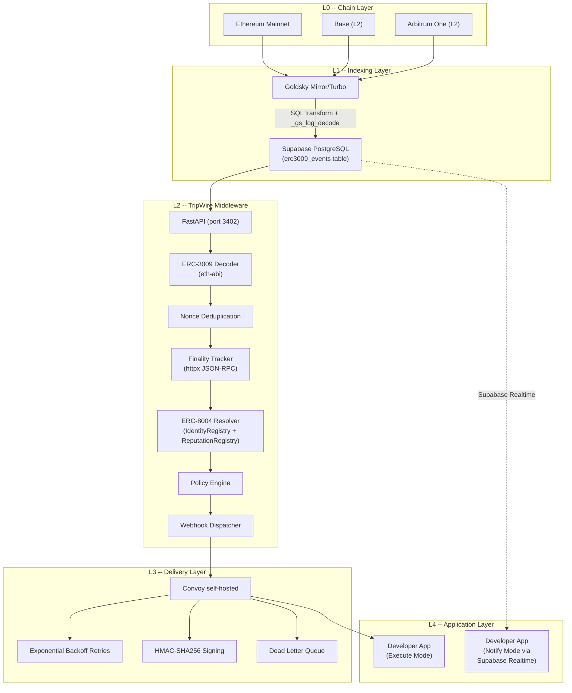
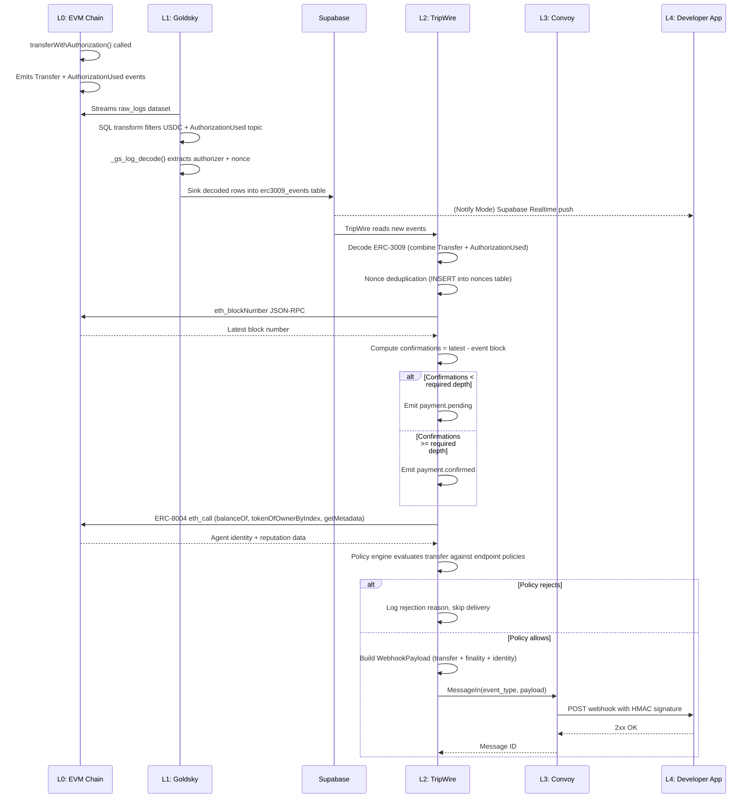
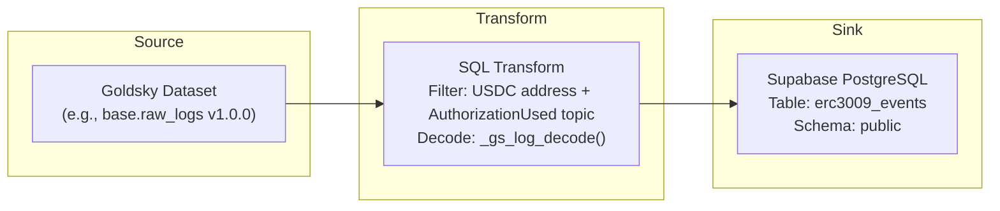
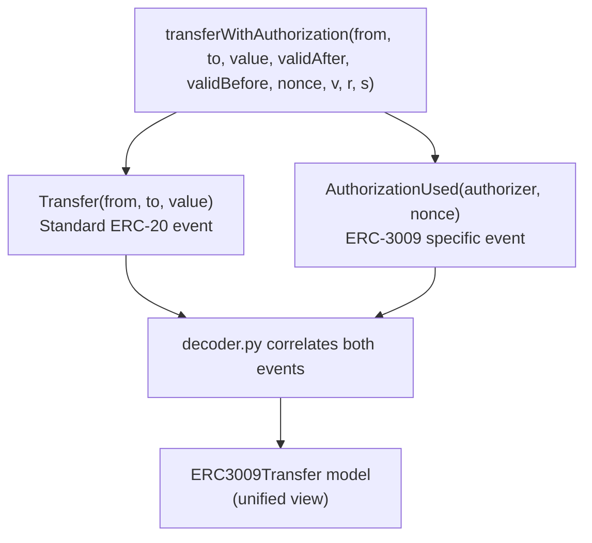
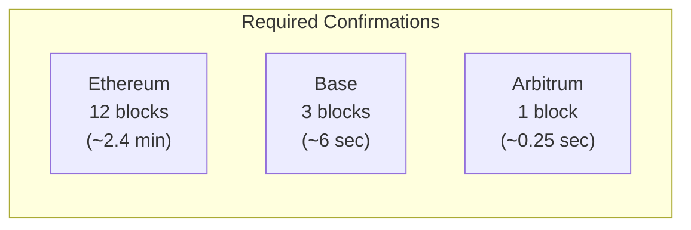
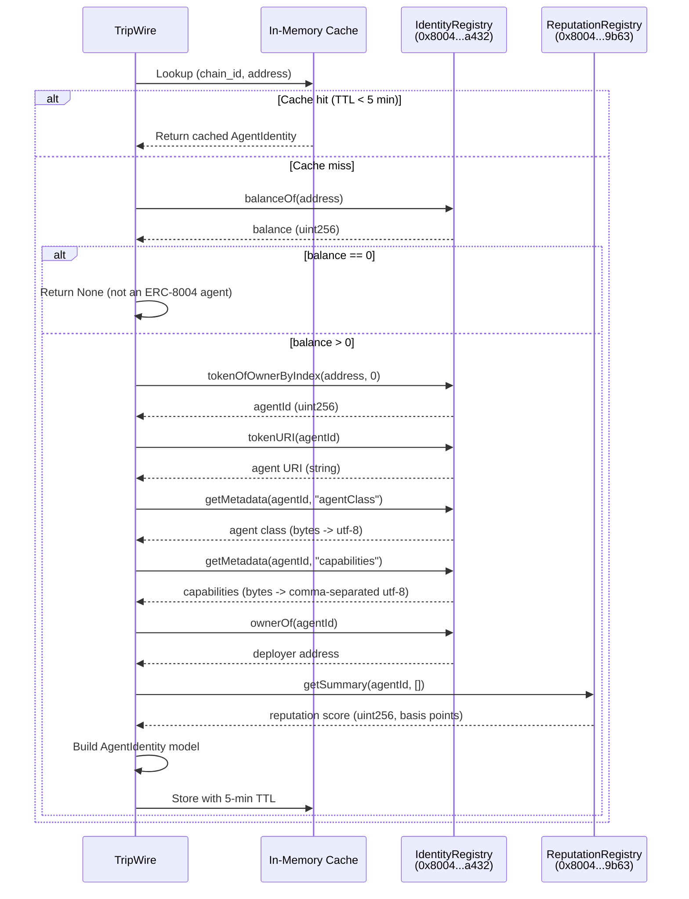
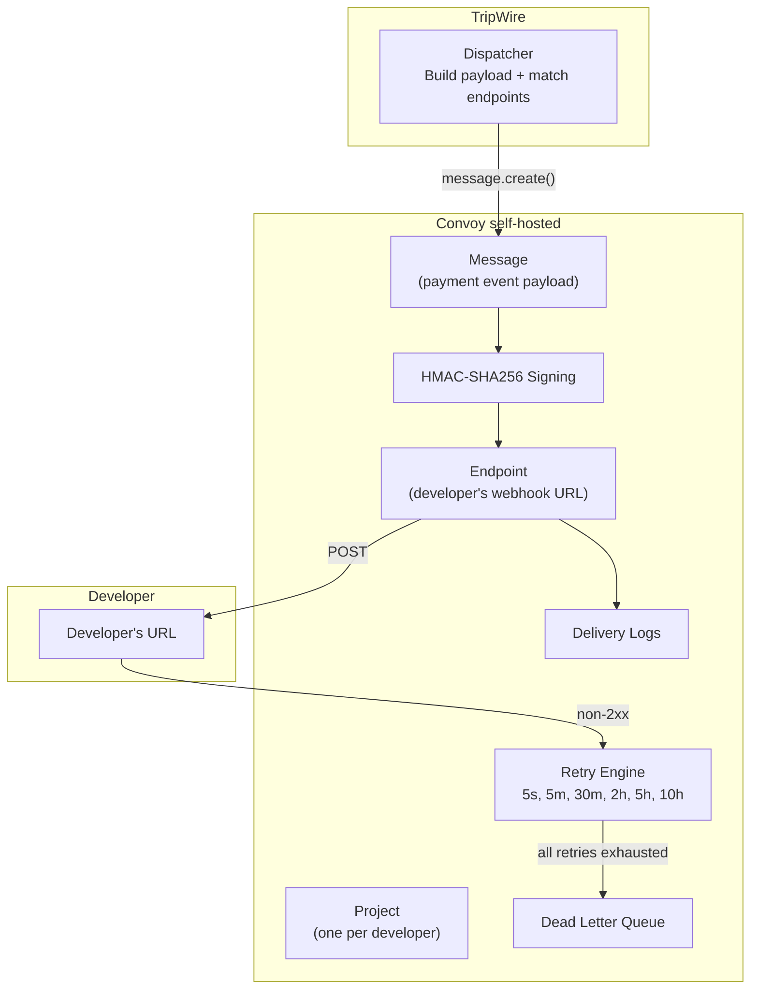
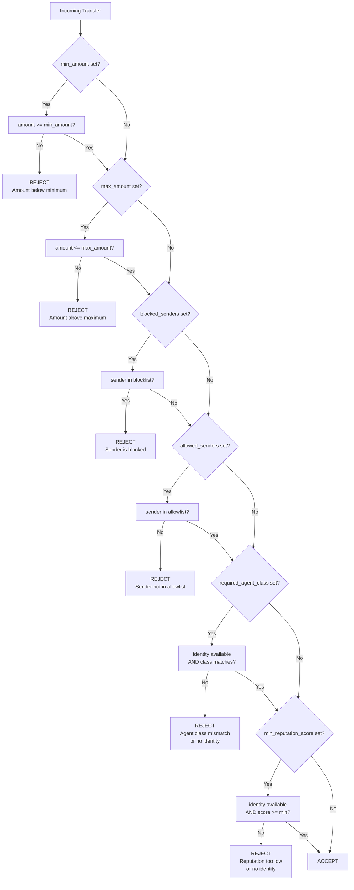
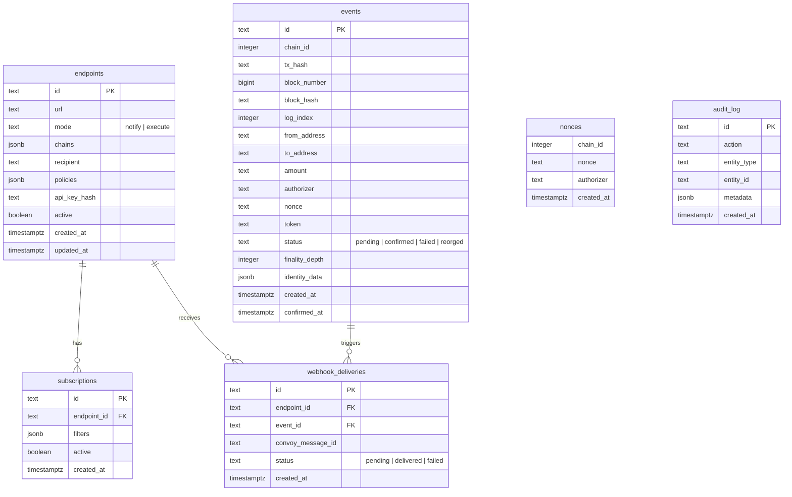
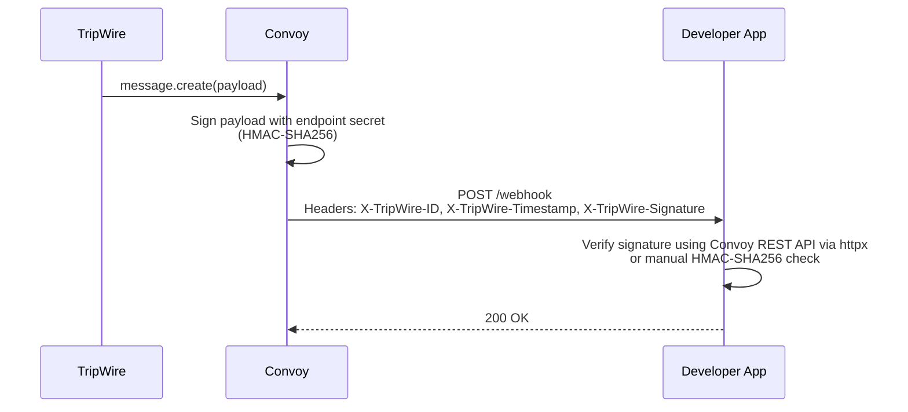

# TripWire Architecture

> "Stripe Webhooks for x402" -- the infrastructure layer between onchain micropayments and application execution.

TripWire is an event-driven middleware that watches ERC-3009 `transferWithAuthorization` payments on EVM chains, verifies finality, resolves onchain AI agent identities via ERC-8004, evaluates developer-defined policies, and delivers structured webhook payloads through Convoy self-hosted.

---

## Table of Contents

1. [System Overview](#system-overview)
2. [Architecture Layers](#architecture-layers)
3. [Event Lifecycle](#event-lifecycle)
4. [Goldsky Pipeline](#goldsky-pipeline)
5. [ERC-3009 Event Processing](#erc-3009-event-processing)
6. [Finality Tracking](#finality-tracking)
7. [ERC-8004 Identity Resolution](#erc-8004-identity-resolution)
8. [Webhook Delivery](#webhook-delivery)
9. [Policy Engine](#policy-engine)
10. [Database Schema](#database-schema)
11. [Security Model](#security-model)

---

## System Overview

TripWire sits between onchain payment settlement and developer applications. It transforms raw blockchain events into actionable, verified webhook payloads that applications can trust and act on without running their own blockchain infrastructure.



### Technology Stack

| Component | Technology | Purpose |
|-----------|-----------|---------|
| Runtime | Python 3.11+ | Async-first application runtime |
| API Framework | FastAPI + Uvicorn | HTTP API server |
| Database | Supabase (managed PostgreSQL) | Event storage, endpoint registry, nonce dedup |
| Blockchain Indexing | Goldsky Mirror/Turbo | Stream raw logs from chains into Supabase |
| Webhook Delivery | Convoy self-hosted | Retries, HMAC signing, DLQ |
| Blockchain RPC | httpx (raw JSON-RPC) | Finality checks, identity resolution |
| ABI Decoding | eth-abi | Decode ERC-3009 event data |
| Validation | Pydantic v2 | Input/output schema validation |
| Logging | structlog | Structured JSON logging |
| HTTP Client | httpx (async) | All outbound HTTP calls |

---

## Architecture Layers

### L0 -- Chain Layer

The onchain source of truth. TripWire monitors ERC-3009 `transferWithAuthorization` payments on three EVM chains:

| Chain | Chain ID | USDC Contract | Finality Depth |
|-------|----------|---------------|----------------|
| Ethereum Mainnet | `1` | `0xA0b86991c6218b36c1d19D4a2e9Eb0cE3606eB48` | 12 blocks |
| Base (L2) | `8453` | `0x833589fCD6eDb6E08f4c7C32D4f71b54bdA02913` | 3 blocks |
| Arbitrum One (L2) | `42161` | `0xaf88d065e77c8cC2239327C5EDb3A432268e5831` | 1 block |

When `transferWithAuthorization` is called on a USDC contract, two events are emitted in the same transaction:

1. `Transfer(address indexed from, address indexed to, uint256 value)` -- the ERC-20 transfer
2. `AuthorizationUsed(address indexed authorizer, bytes32 indexed nonce)` -- the ERC-3009 authorization proof

### L1 -- Goldsky Indexing Layer

Goldsky Mirror/Turbo reads raw logs from each chain, applies a SQL transform that filters for `AuthorizationUsed` events on USDC contracts, decodes them using `_gs_log_decode()`, and sinks the decoded rows directly into Supabase PostgreSQL. This is a fully managed pipeline -- no TripWire server processes are involved in indexing.

### L2 -- TripWire Middleware Layer

The core application layer, implemented as a FastAPI service. It performs:

- **Decoding**: Combines `AuthorizationUsed` and `Transfer` event data into a unified `ERC3009Transfer` model using `eth-abi`.
- **Deduplication**: Inserts the `(chain_id, nonce, authorizer)` tuple into the `nonces` table; the unique constraint rejects replays.
- **Finality tracking**: Queries the chain's latest block via `eth_blockNumber` JSON-RPC and computes confirmation depth.
- **Identity resolution**: Resolves the sender's ERC-8004 onchain agent identity (agent class, capabilities, reputation score) from the IdentityRegistry and ReputationRegistry contracts.
- **Policy evaluation**: Checks the transfer against the endpoint's configured policies (amount bounds, sender lists, agent class, reputation threshold).
- **Dispatch**: Builds a `WebhookPayload` and sends it to Convoy for delivery.

### L3 -- Convoy Delivery Layer

Convoy self-hosted is a webhook delivery service. TripWire delegates all delivery concerns to Convoy with a single API call per message:

- **Retries**: Exponential backoff (5s, 5m, 30m, 2h, 5h, 10h) -- up to 6 attempts over ~17 hours.
- **HMAC-SHA256 signing**: Every payload is signed. Developers verify signatures using the Convoy REST API via httpx or manual HMAC verification.
- **Dead Letter Queue (DLQ)**: Failed messages after all retry attempts are preserved for manual inspection and replay.
- **Delivery logs**: Full audit trail of every attempt, response code, and timing.

### L4 -- Application Layer

Developers receive verified payment events in two modes:

- **Execute mode**: Convoy delivers a webhook to the developer's registered URL. The developer's server executes business logic upon receipt.
- **Notify mode**: The developer subscribes to Supabase Realtime and receives events as database row changes. No webhook server required.

---

## Event Lifecycle

The complete journey of an x402 payment from chain settlement to developer delivery:



### Step-by-Step

1. **Payment on chain**: A payer calls `transferWithAuthorization()` on a USDC contract. The transaction emits both a `Transfer` event and an `AuthorizationUsed` event.
2. **Goldsky detects**: Goldsky's Mirror/Turbo pipeline streams `raw_logs` from the chain. A SQL transform filters for logs where `address = USDC_CONTRACT` and `topic0 = keccak256("AuthorizationUsed(address,bytes32)")`, then decodes the log using `_gs_log_decode()`.
3. **Supabase stores**: Decoded rows are sunk into the `erc3009_events` table in Supabase PostgreSQL.
4. **TripWire processes**: The middleware reads new events, decodes the full ERC-3009 transfer (correlating `Transfer` and `AuthorizationUsed` logs), and attempts nonce deduplication.
5. **Finality check**: TripWire queries `eth_blockNumber` via JSON-RPC and computes confirmations. If below the required depth for the chain, the event is marked `payment.pending`; otherwise `payment.confirmed`.
6. **Identity enrichment**: The sender's address is resolved against the ERC-8004 IdentityRegistry contract to retrieve agent class, capabilities, deployer, and reputation score.
7. **Policy evaluation**: The transfer is checked against the endpoint's policies (amount bounds, sender allowlist/blocklist, required agent class, minimum reputation score).
8. **Convoy delivers**: If the policy passes, TripWire builds a `WebhookPayload` and sends it to Convoy via `message.create()`. Convoy handles HMAC signing, delivery, retries, and DLQ.
9. **Developer receives**: The developer's registered endpoint receives a signed HTTP POST with the full payment payload including transfer data, finality status, and agent identity.

---

## Goldsky Pipeline

Goldsky Mirror/Turbo is a managed blockchain indexing service that streams onchain data into external sinks. TripWire uses it to pipe ERC-3009 events from multiple chains into Supabase without running any indexing infrastructure.

### Pipeline Configuration

Each chain gets its own pipeline, generated programmatically by `tripwire/ingestion/pipeline.py`. The configuration follows the Goldsky Mirror YAML specification:



#### Generated YAML Structure

```yaml
version: "1"
name: tripwire-base-erc3009
sources:
  base_logs:
    type: dataset
    dataset_name: base.raw_logs
    version: 1.0.0
transforms:
  erc3009_decoded:
    primary_key: id
    sql: >
      SELECT id, block_number, block_hash, transaction_hash, log_index,
             block_timestamp,
             _gs_log_decode('event AuthorizationUsed(address indexed authorizer,
                             bytes32 indexed nonce)', topics, data) AS decoded
      FROM base_logs
      WHERE address = '0x833589fcd6edb6e08f4c7c32d4f71b54bda02913'
        AND topic0 = '0x98de503528ee59b575ef0c0a2576a82497bfc029a5685b209e9ec333479b10a5'
sinks:
  supabase_sink:
    type: postgres
    table: erc3009_events
    schema: public
    secret_name: SUPABASE_SECRET
    from: erc3009_decoded
```

### Key Design Decisions

- **Filter at the source**: The SQL transform filters by USDC contract address and `AuthorizationUsed` topic0 hash *before* sinking, so only ERC-3009 events reach Supabase. This avoids storing millions of irrelevant Transfer logs.
- **`_gs_log_decode()`**: Goldsky's built-in ABI decoder extracts `authorizer` and `nonce` from the raw `topics` and `data` fields inline in the SQL transform.
- **One pipeline per chain**: Each supported chain (Ethereum, Base, Arbitrum) gets a separate pipeline (`tripwire-ethereum-erc3009`, `tripwire-base-erc3009`, `tripwire-arbitrum-erc3009`) with its own dataset source.
- **Reorg handling**: Goldsky Mirror has built-in reorg detection. When a chain reorganization occurs, Goldsky replays the affected blocks and updates the sink accordingly. The `block_hash` field in the events table allows TripWire to detect and handle reorged events (emitting `payment.reorged` events).

### Pipeline Lifecycle

The `pipeline.py` module provides CLI wrappers for the `goldsky` CLI:

| Function | Command | Purpose |
|----------|---------|---------|
| `deploy_pipeline(chain_id)` | `goldsky pipeline apply <config.yaml>` | Deploy a new pipeline |
| `get_pipeline_status(chain_id)` | `goldsky pipeline status <name>` | Check pipeline health |
| `stop_pipeline(chain_id)` | `goldsky pipeline stop <name>` | Pause indexing |
| `start_pipeline(chain_id)` | `goldsky pipeline start <name>` | Resume indexing |

---

## ERC-3009 Event Processing

ERC-3009 defines `transferWithAuthorization`, a function (not an event) that allows gasless USDC transfers using a signed authorization. When called, two events are emitted in the same transaction:



### Event Topics

| Event | Topic0 (keccak256) |
|-------|-------------------|
| `AuthorizationUsed(address,bytes32)` | `0x98de503528ee59b575ef0c0a2576a82497bfc029a5685b209e9ec333479b10a5` |
| `Transfer(address,address,uint256)` | `0xddf252ad1be2c89b69c2b068fc378daa952ba7f163c4a11628f55a4df523b3ef` |

### Decoding with eth-abi

The decoder module (`tripwire/ingestion/decoder.py`) provides two decoding paths:

**1. Raw log decoding** (`decode_erc3009_from_logs`): For processing raw transaction logs that contain both events. It:
- Iterates all logs in a transaction
- Filters for logs from known USDC contract addresses
- Matches `Transfer` and `AuthorizationUsed` by `topic0`
- Decodes `Transfer`: `from` and `to` from indexed topics (address from last 40 hex chars), `value` from `data` via `eth_abi.decode(["uint256"], data)`
- Decodes `AuthorizationUsed`: `authorizer` from `topic[1]`, `nonce` from `topic[2]` (bytes32 hex)
- Combines both into a single `ERC3009Transfer` model

**2. Goldsky-decoded rows** (`decode_transfer_event`): For rows already decoded by Goldsky's `_gs_log_decode()` SQL transform. The `decoded` column contains extracted `authorizer` and `nonce` fields directly.

### Contract Validation

The decoder validates that the emitting contract address matches the expected USDC contract for the resolved chain:

```python
_CONTRACT_TO_CHAIN: dict[str, ChainId] = {
    addr.lower(): chain_id for chain_id, addr in USDC_CONTRACTS.items()
}
```

If the contract address does not match, a `ValueError` is raised, preventing spoofed events from non-USDC contracts.

### Nonce Deduplication

Each ERC-3009 authorization has a unique `bytes32` nonce scoped to the `authorizer` address and `chain_id`. TripWire enforces deduplication via a database unique constraint:

```sql
CREATE TABLE nonces (
    chain_id    INTEGER NOT NULL,
    nonce       TEXT NOT NULL,
    authorizer  TEXT NOT NULL,
    UNIQUE (chain_id, nonce, authorizer)
);
```

When processing a new event, TripWire attempts to `INSERT` into the `nonces` table. If the `(chain_id, nonce, authorizer)` tuple already exists, the insert fails and the event is skipped as a duplicate. This guarantees at-most-once processing per authorization nonce.

---

## Finality Tracking

Block finality determines when a transaction can be considered irreversible. TripWire tracks finality by comparing confirmation depth (current block minus event block) against chain-specific thresholds.

### Confirmation Depths



| Chain | Confirmations Required | Approximate Time |
|-------|----------------------|------------------|
| Ethereum | 12 blocks | ~2.4 minutes |
| Base | 3 blocks | ~6 seconds |
| Arbitrum | 1 block | ~0.25 seconds |

These depths are defined in `tripwire/types/models.py`:

```python
FINALITY_DEPTHS: dict[ChainId, int] = {
    ChainId.ETHEREUM: 12,
    ChainId.BASE: 3,
    ChainId.ARBITRUM: 1,
}
```

### JSON-RPC Approach

TripWire uses raw JSON-RPC calls via `httpx` (no `web3.py` dependency) to query the latest block number:

```python
payload = {
    "jsonrpc": "2.0",
    "method": "eth_blockNumber",
    "params": [],
    "id": 1,
}
```

The `check_finality` function computes:

```
confirmations = max(0, current_block - transfer.block_number)
is_finalized  = confirmations >= FINALITY_DEPTHS[chain_id]
```

### FinalityStatus Model

The result is a `FinalityStatus` model containing:

| Field | Type | Description |
|-------|------|-------------|
| `tx_hash` | `str` | Transaction hash |
| `chain_id` | `ChainId` | Chain identifier |
| `block_number` | `int` | Block the event was included in |
| `confirmations` | `int` | Current confirmation count |
| `required_confirmations` | `int` | Chain-specific threshold |
| `is_finalized` | `bool` | Whether the threshold is met |
| `finalized_at` | `int \| None` | Block number at which finality was reached |

### Event Types by Finality

| Finality State | WebhookEventType | Meaning |
|----------------|------------------|---------|
| Confirmations < required | `payment.pending` | Transaction seen but not yet final |
| Confirmations >= required | `payment.confirmed` | Transaction is considered irreversible |
| Block reorged | `payment.reorged` | Transaction was removed by a chain reorganization |
| Validation failure | `payment.failed` | Decoding or contract validation failed |

---

## ERC-8004 Identity Resolution

ERC-8004 is an onchain AI agent identity registry (went mainnet January 29, 2026). TripWire uses it to enrich payment events with sender identity data, enabling developers to make policy decisions based on who (or what) is paying.

### Registry Contracts

Both contracts are deployed via CREATE2 at the same address on all supported chains:

| Contract | Address |
|----------|---------|
| IdentityRegistry | `0x8004A169FB4a3325136EB29fA0ceB6D2e539a432` |
| ReputationRegistry | `0x8004BAa17C55a88189AE136b182e5fdA19dE9b63` |

### Resolution Flow

The ERC-8004 IdentityRegistry is an ERC-721 contract. Each registered agent owns an NFT (token) representing its onchain identity. Resolution proceeds through a series of `eth_call` requests:



### Step-by-Step Resolution

1. **`balanceOf(address)`** -- Check if the sender address owns an ERC-8004 identity NFT. If balance is 0, the sender is not a registered agent; return `None`.
2. **`tokenOfOwnerByIndex(address, 0)`** -- Get the first (index 0) token ID owned by the address. This is the `agentId`.
3. **`tokenURI(agentId)`** -- Retrieve the agent's metadata URI (e.g., an HTTPS or IPFS URL pointing to off-chain metadata).
4. **`getMetadata(agentId, "agentClass")`** -- Read the `agentClass` key from the token's onchain metadata. Returns raw bytes decoded as UTF-8 (e.g., `"trading-bot"`, `"data-oracle"`, `"payment-agent"`).
5. **`getMetadata(agentId, "capabilities")`** -- Read the `capabilities` key. Returns a comma-separated UTF-8 string (e.g., `"swap,limit-order,portfolio-rebalance"`).
6. **`ownerOf(agentId)`** -- Get the deployer (token owner/minter) address.
7. **`getSummary(agentId, [])` on ReputationRegistry** -- Fetch the aggregate reputation score. The registry returns a `uint256` in basis points (0--10000), which TripWire converts to a 0--100 float.

### Caching Strategy

Identity resolution requires 6--7 `eth_call` RPC requests per address. To avoid excessive RPC load:

- **In-memory cache** with a 5-minute TTL (`_CACHE_TTL = 300` seconds)
- Cache key: `"{chain_id}:{address_lowercase}"`
- Both positive results (`AgentIdentity`) and negative results (`None` for non-agents) are cached
- Cache entries use `time.monotonic()` for expiry to avoid clock drift issues

### Development Mode

In development (`APP_ENV=development`), a `MockResolver` is used instead of the real ERC-8004 resolver. It provides three pre-configured agent identities for testing without requiring RPC access.

### AgentIdentity Model

| Field | Type | Description |
|-------|------|-------------|
| `address` | `str` | Agent's Ethereum address (lowercased) |
| `agent_class` | `str` | Classification (e.g., `"trading-bot"`, `"data-oracle"`) |
| `deployer` | `str` | Address that deployed/minted the agent NFT |
| `capabilities` | `list[str]` | List of declared capabilities |
| `reputation_score` | `float` (0--100) | Aggregate reputation from the ReputationRegistry |
| `registered_at` | `int` | Registration timestamp (or token ID as proxy) |
| `metadata` | `dict` | Additional data (`agent_id`, `agent_uri`) |

---

## Webhook Delivery

TripWire uses Convoy self-hosted as a webhook delivery service. The integration is implemented in `tripwire/webhook/convoy_client.py` (Convoy REST API via httpx wrapper) and `tripwire/webhook/dispatcher.py` (orchestration layer).

### Convoy Model



### Convoy Resource Mapping

| Convoy Concept | TripWire Mapping |
|---------------|-----------------|
| Project | One per registered developer/endpoint |
| Endpoint | Developer's webhook URL |
| Message | A single `WebhookPayload` (payment event) |
| Event Type | `payment.confirmed`, `payment.pending`, `payment.failed`, `payment.reorged` |

### Retry Schedule

Convoy handles retries for failed deliveries (non-2xx responses) on an exponential backoff schedule:

| Attempt | Delay After Previous |
|---------|---------------------|
| 1 | Immediate |
| 2 | 5 seconds |
| 3 | 5 minutes |
| 4 | 30 minutes |
| 5 | 2 hours |
| 6 | 5 hours |

If all 6 attempts fail, the message is moved to the Dead Letter Queue (DLQ) for manual inspection and replay via `retry_message()`.

### Endpoint Matching

When a new ERC-3009 transfer is processed, TripWire matches it against registered endpoints:

```python
def match_endpoints(transfer, endpoints) -> list[Endpoint]:
    # An endpoint matches if:
    # 1. endpoint.recipient == transfer.to_address (case-insensitive)
    # 2. transfer.chain_id is in endpoint.chains
    # 3. endpoint.active == True
```

For Notify mode, subscriptions are matched against transfer data using filters:

| Filter | Match Condition |
|--------|----------------|
| `chains` | `transfer.chain_id` is in the list |
| `senders` | `transfer.from_address` is in the list (case-insensitive) |
| `recipients` | `transfer.to_address` is in the list (case-insensitive) |
| `min_amount` | `transfer.value >= min_amount` |
| `agent_class` | Sender's ERC-8004 `agent_class` matches |

### Execute vs Notify Mode

| Aspect | Execute Mode | Notify Mode |
|--------|-------------|-------------|
| Delivery | Convoy webhook POST | Supabase Realtime push |
| Server required | Yes (developer hosts a URL) | No (client-side subscription) |
| Retries | Convoy handles retries (6 attempts) | Supabase Realtime reconnection |
| Signing | HMAC-SHA256 via Convoy | N/A (Supabase auth) |
| Use case | Server-to-server automation | Client-side dashboards, notifications |

### Webhook Payload Structure

```json
{
  "id": "550e8400-e29b-41d4-a716-446655440000",
  "type": "payment.confirmed",
  "mode": "execute",
  "timestamp": 1710000000,
  "data": {
    "transfer": {
      "chain_id": 8453,
      "tx_hash": "0xabc...",
      "block_number": 12345678,
      "from_address": "0x...",
      "to_address": "0x...",
      "amount": "1000000",
      "nonce": "0x...",
      "token": "0x833589fCD6eDb6E08f4c7C32D4f71b54bdA02913"
    },
    "finality": {
      "confirmations": 3,
      "required_confirmations": 3,
      "is_finalized": true
    },
    "identity": {
      "address": "0x...",
      "agent_class": "trading-bot",
      "deployer": "0x...",
      "capabilities": ["swap", "limit-order"],
      "reputation_score": 85.0,
      "registered_at": 1738108800,
      "metadata": {"agent_id": 1, "agent_uri": "..."}
    }
  }
}
```

---

## Policy Engine

The policy engine (`tripwire/api/policies/engine.py`) evaluates whether a transfer should be delivered to an endpoint based on developer-configured rules. Policies are attached to endpoints at registration time.

### Evaluation Flow



### Policy Fields

All fields are optional. If a field is not set (`None`), that check is skipped.

| Field | Type | Description |
|-------|------|-------------|
| `min_amount` | `str \| None` | Minimum transfer amount (in smallest unit, USDC 6 decimals). Reject if `amount < min_amount`. |
| `max_amount` | `str \| None` | Maximum transfer amount. Reject if `amount > max_amount`. |
| `allowed_senders` | `list[str] \| None` | Allowlist of sender addresses. If set, only these senders can trigger webhooks. |
| `blocked_senders` | `list[str] \| None` | Blocklist of sender addresses. Checked before allowlist. |
| `required_agent_class` | `str \| None` | Required ERC-8004 agent class (e.g., `"trading-bot"`). Requires identity resolution. |
| `min_reputation_score` | `float \| None` | Minimum ERC-8004 reputation score (0--100). Requires identity resolution. |
| `finality_depth` | `int` | Custom finality depth override (default 3, range 1--64). |

### Evaluation Order

1. **Amount range** -- `min_amount`, then `max_amount`
2. **Sender blocklist** -- `blocked_senders`
3. **Sender allowlist** -- `allowed_senders`
4. **Agent class** -- `required_agent_class` (requires ERC-8004 identity)
5. **Reputation** -- `min_reputation_score` (requires ERC-8004 identity)

The function returns `(allowed: bool, reason: str | None)`. If `allowed` is `False`, `reason` contains a human-readable explanation.

---

## Database Schema

TripWire uses Supabase (managed PostgreSQL) with the following schema, defined in `tripwire/db/migrations/001_initial.sql`.

### ER Diagram



### Table Descriptions

#### `endpoints`
Developer-registered webhook endpoints. Each endpoint specifies a URL, delivery mode (execute or notify), the chains to monitor, the USDC recipient address, and optional policies. The `api_key_hash` stores a hashed API key for authenticating management requests.

**Key indexes**: `recipient` (for matching transfers), `active` (partial index on `TRUE`), `mode`.

#### `subscriptions`
Notify-mode subscription filters attached to endpoints. Each subscription defines filter criteria (chains, senders, recipients, min_amount, agent_class) that determine which events trigger Supabase Realtime notifications. Cascades on endpoint deletion.

#### `events`
Combined ERC-3009 event data: Transfer fields (`from_address`, `to_address`, `amount`) plus AuthorizationUsed fields (`authorizer`, `nonce` as bytes32 hex). Tracks lifecycle via `status` (pending/confirmed/failed/reorged) and stores resolved identity data as JSONB.

**Key indexes**: `(chain_id, tx_hash)` for transaction lookup, `to_address` and `from_address` for address-based queries, `(chain_id, nonce, authorizer)` for deduplication cross-reference, `(chain_id, block_number)` for finality range scans, `created_at` for cursor pagination.

#### `nonces`
Deduplication table. The `UNIQUE (chain_id, nonce, authorizer)` constraint enforces that each ERC-3009 authorization nonce can only be processed once per chain and authorizer. INSERT failures on this constraint indicate duplicate events.

#### `webhook_deliveries`
Tracks the relationship between events and endpoint deliveries. Stores the Convoy message ID for cross-referencing delivery status with Convoy's delivery logs. Cascades on both endpoint and event deletion.

#### `audit_log`
Immutable append-only log of system actions. Records the action type, affected entity, and metadata JSONB for forensic analysis. Primary key is auto-generated via `gen_random_uuid()`.

### Key Design Decisions

1. **Nonce deduplication via unique constraint**: Rather than application-level deduplication (which is race-prone), TripWire uses a PostgreSQL unique constraint on `(chain_id, nonce, authorizer)`. This is atomic, idempotent, and works correctly under concurrent writes.

2. **Cursor pagination via `created_at`**: The `idx_events_created_at` index supports efficient cursor-based pagination for the events API. Clients pass the last seen `created_at` timestamp to fetch the next page.

3. **Amounts as text**: All USDC amounts are stored as `TEXT` (not numeric) to preserve exact 6-decimal precision without floating-point rounding errors. Application code handles conversion to integers for comparison.

4. **JSONB for flexible fields**: `chains` (array), `policies` (object), `filters` (object), and `identity_data` (object) use JSONB for schema flexibility while keeping the core relational structure strict.

5. **Cascade deletes**: `subscriptions` and `webhook_deliveries` cascade on endpoint deletion, ensuring referential integrity without orphaned records.

6. **Partial indexes**: The `active = TRUE` partial indexes on `endpoints` and `subscriptions` optimize the hot path (querying only active records) without indexing deactivated rows.

---

## Security Model

### HMAC-SHA256 Webhook Signing

Every webhook payload delivered by Convoy is signed with HMAC-SHA256. The signing process is handled entirely by Convoy:



Each Convoy endpoint gets a unique signing secret. Developers verify incoming webhooks by:
1. Extracting `X-TripWire-ID`, `X-TripWire-Timestamp`, and `X-TripWire-Signature` headers
2. Computing `HMAC-SHA256(secret, "{X-TripWire-ID}.{X-TripWire-Timestamp}.{body}")` and comparing against the signature
3. Rejecting requests where the timestamp is older than a tolerance window (replay protection)

### Nonce Replay Protection

ERC-3009 authorizations include a `bytes32` nonce that is unique per `(chain_id, authorizer)`. TripWire enforces at-most-once processing:

```
INSERT INTO nonces (chain_id, nonce, authorizer) VALUES ($1, $2, $3)
-- Fails with unique constraint violation if already processed
```

This prevents:
- **Double-spending**: The same authorization nonce cannot trigger multiple webhook deliveries
- **Replay attacks**: Re-submitting an already-processed event is rejected at the database level
- **Race conditions**: The PostgreSQL unique constraint is atomic, handling concurrent inserts correctly

### API Key Authentication

Endpoints store `api_key_hash` -- a hashed API key used to authenticate management requests (updating endpoint configuration, listing deliveries, etc.). The raw API key is never stored.

### Contract Address Validation

The decoder validates that events originate from the expected USDC contract address for each chain:

```python
expected = USDC_CONTRACTS[chain_id].lower()
if contract != expected:
    raise ValueError(...)
```

This prevents processing events from rogue contracts that emit `AuthorizationUsed` or `Transfer` events with the same topic signatures but from different (potentially malicious) contract addresses.

### Supabase Service Role Key

TripWire uses the `supabase_service_role_key` (not the anon key) for database operations. The service role key bypasses Row Level Security (RLS), which is appropriate for a backend service but must be kept secret. The anon key is stored separately for potential client-facing features.

### Summary of Security Layers

| Layer | Mechanism | Protects Against |
|-------|-----------|-----------------|
| Webhook signing | HMAC-SHA256 via Convoy | Payload tampering, webhook spoofing |
| Timestamp validation | Convoy signature includes timestamp | Replay attacks on webhook delivery |
| Nonce deduplication | PostgreSQL unique constraint | Double-processing, replay of onchain events |
| API key hashing | Stored hash, not plaintext | Credential theft from database breach |
| Contract validation | Address check against known USDC contracts | Spoofed events from malicious contracts |
| Service role isolation | Supabase service_role key (backend only) | Unauthorized database access |
